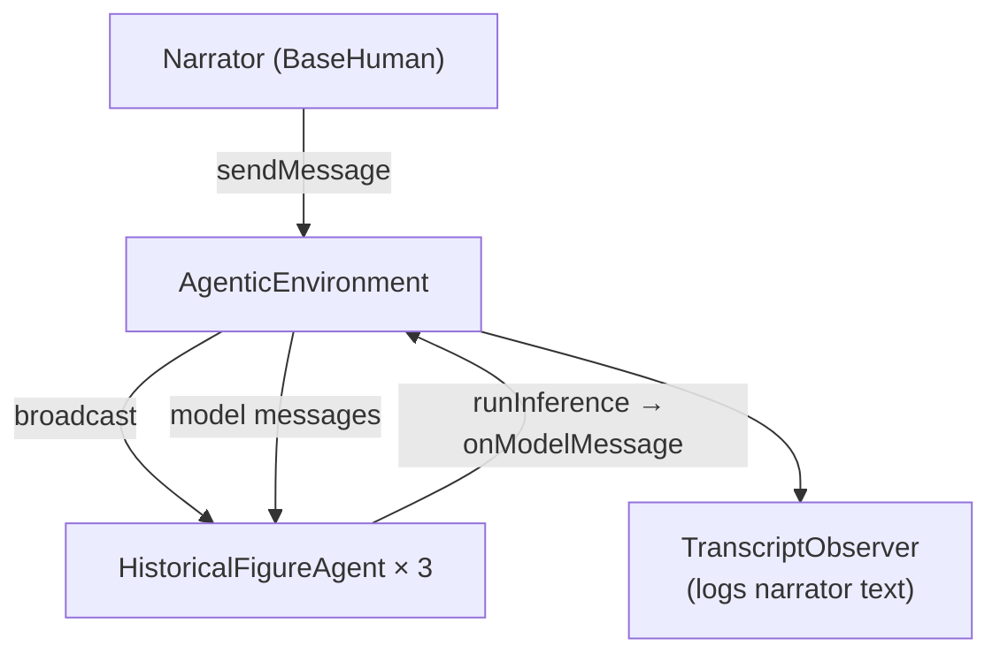

# History Simulation

A multi-agent historical debate built on Mozaik's `AgenticEnvironment`. Three AI agents—Julius Caesar, Pompey Magnus, and Cato the Younger—argue over Rome's fate in 49 BCE while a human narrator sets the scene and a transcript observer logs the conversation.

Each agent maintains its own `ModelContext`, reacts to messages from other participants, and speaks in first person with historically plausible, debate-style replies.

## How it works

The example wires several participants into one shared `AgenticEnvironment`:

1. **`main.ts` bootstraps the runtime** — creates an `OpenAIInferenceRunner`, a `Gpt54Mini` model, and a `DefaultFunctionCallRunner` (no tools in this example). It instantiates three `HistoricalFigureAgent` instances, each with a separate `ModelContext` so Caesar, Pompey, and Cato keep independent conversation histories.

2. **Participants join the environment** — a `BaseHuman` (narrator), a `TranscriptObserver`, and the three agents all call `join(environment)`, then `environment.start()` begins routing events.

3. **The narrator opens the scene** — `human.sendMessage(...)` broadcasts the 49 BCE scenario to every participant. The observer prints it; each agent appends it to its context and calls `runInference`.

4. **Agents speak and trigger each other** — when an agent finishes inference, `onModelMessage` logs the reply and the environment broadcasts that `ModelMessageItem` to the other participants. Each listener receives it via `onExternalModelMessage`, records it as *"Another participant said: …"*, and runs inference again with that added context.

5. **The debate cascades** — there is no turn-taking scheduler. Every new message can cause multiple agents to infer in parallel, so the conversation fans out organically until you stop the process.



`HistoricalFigureAgent` extends `BaseAgent` and seeds each context with a system-style user message defining the figure's name, role, and debate rules. `TranscriptObserver` extends `BaseObserver` and only formats narrator input for the console; agent lines are logged inside the agent's `onModelMessage` handler.

## Run

From the repository root (with `OPENAI_API_KEY` in `.env`):

```bash
npx tsx history-simulation/main.ts
```

The simulation starts automatically: the narrator posts the scenario, then the three figures take turns responding as the debate unfolds. Output is printed to the console.

## Example output


Each run produces different dialogue. Agents continue to react to one another until you stop the process.

## Layout

| File | Role |
|------|------|
| `main.ts` | Wires the environment, models, human narrator, observer, and three historical agents |
| `historical-figure-agent.ts` | `HistoricalFigureAgent` — role-prompted agent that reacts to messages and other participants |
| `transcript-observer.ts` | Logs narrator messages to the console |
